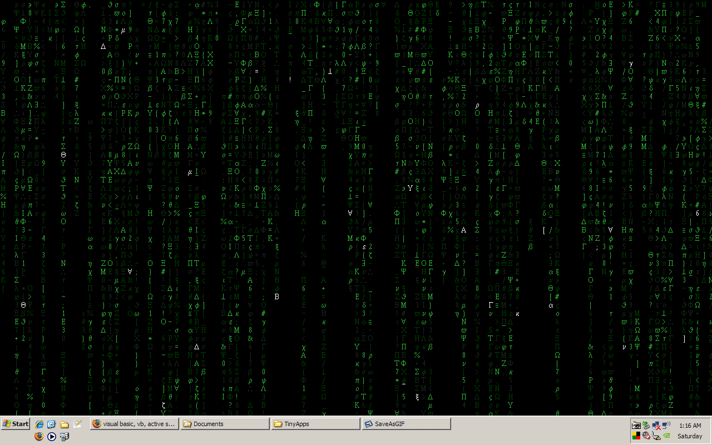



## The Matrix desktop

### Description

It's a form that covers your desktop with scrolling text simulating The Matrix screens as seen in the movie. It uses surprisingly low CPU (0% on my Athlon 1800, 1440x900 resolution). It's not exactly the same but the code is commented to help out newcomers to VB6.
 
### More Info
 

             |
---                |---
**Submitted On**   |2008-04-26 02:31:50
**By**             |[AlanMN](https://github.com/Planet-Source-Code/PSCIndex/blob/master/ByAuthor/alanmn.md)
**Level**          |Beginner
**User Rating**    |4.8 (24 globes from 5 users)
**Compatibility**  |VB 6\.0
**Category**       |[Complete Applications](https://github.com/Planet-Source-Code/PSCIndex/blob/master/ByCategory/complete-applications__1-27.md)
**World**          |[Visual Basic](https://github.com/Planet-Source-Code/PSCIndex/blob/master/ByWorld/visual-basic.md)
**Archive File**   |[The\_Matrix2112995162008\.zip](https://github.com/Planet-Source-Code/alanmn-the-matrix-desktop__1-70549/archive/master.zip)

